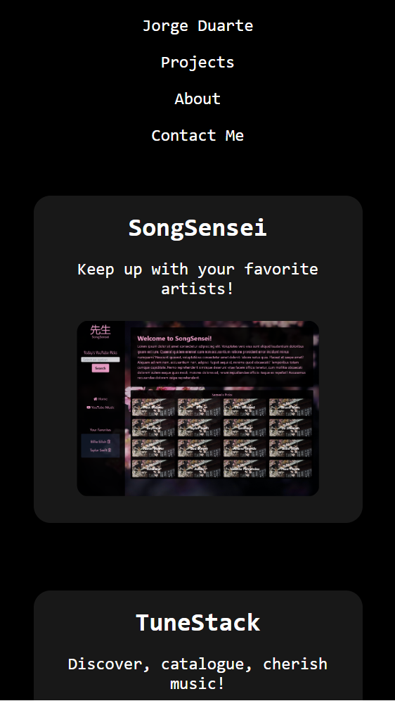

# React Developer Potfolio

## Description

The motivation behind this project was to solidify my knowledge of React. I was to build a portfolio based on my knowledge of React. Additionaly, this challenge introduced me to the concepts of state, react router, and components. Understanding the component and styling structure was crucial. 

Screenshot of mobile version of portfolio when deployed:

## Installation

N/A

## Usage

N/A

## Credits

N/A

## License

Please refer to the LICENSE in the repo.